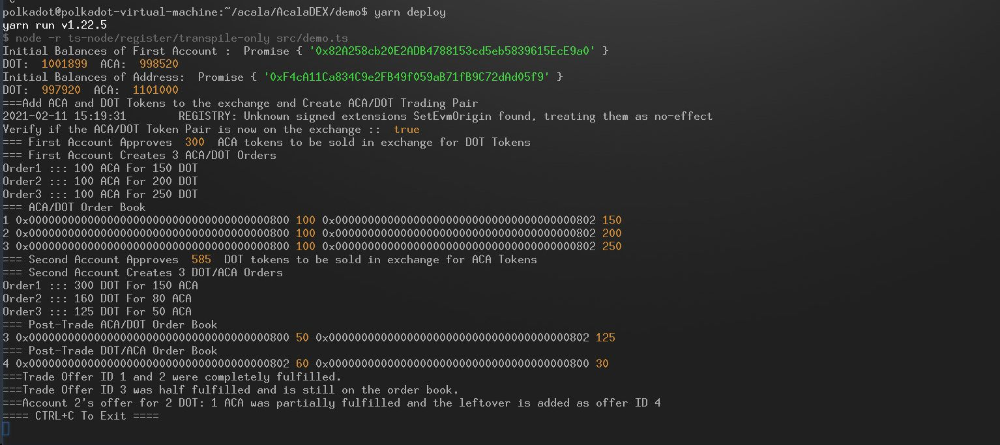

# On-chain Decentralized Order Book and Limit Order Matching Engine on Acala

This contract is a simplified and heavily modified version of Maker On-Chain OTC-Market for ERC-20 compatible tokens available [here.](https://github.com/daifoundation/maker-otc). Orderbooks for buy/sell markets are implemented as two double-linked sorted lists. Match Engine tries to match any new offer with existing offers. If there is no match, the new offer is added to the orderbook. At any point in time, the liquidity of the exchange is directly proportional to number of existing offers in the buy/sell markets.

There are two separate folders in this repository. First folder waffle builds and tests contract. Second folder demo already contains contract artifacts and runs a demo of the contract. Both folders require a development Acala Mandala chain. See instructions at [https://github.com/AcalaNetwork/evm-examples](https://github.com/AcalaNetwork/evm-examples)

### Build and Test Contract

```
cd waffle
yarn install
yarn build
yarn test
```

### Run Demo

```
cd demo
yarn install
yarn deploy
```



### Matching Engine Function Calls

Create Trade Offer : Exchange Token1 (Sell) for Token2 (Buy).

```tradeOffer(address _tokenAddress1, uint _quantity1, address _tokenAddress2, uint _quantity2) returns (uint _id)```

Cancel Offer.

```cancelOffer(uint _id) ```

Create a Token Pair if it doesn't already exist.

```createTokenPair(address _tokenAddress1, address _tokenAddress2) ```

Get number of offers on the book for a given trading pair

```getOfferSize(address sellAddress, address buyAddress) public view returns (uint)```

Get the best offer on the book for a given trading pair

```getBestOffer(address sellAddress, address buyAddress) public view returns (uint)```

Navigate through the sorted Order book for a given pair

```
getNextOffer(uint id) public view returns(uint)
getPrevOffer(uint id) public view returns(uint)
```


### Matching Engine Algorithm

Let `tSellQuantity` be the amount taker is selling.
Let `tBuyQuantity` is the amount taker is buying.

Let `mSellQuantity` be the amount maker is selling.
Let `mBuyQuantity` is the amount maker is buying.

Check if `(tSellQuantity/tBuyQuantity >= mBuyQuantity/mSellQuantity)` is true. If true, internal function `buy(uint id, uint quantity) ` is called to execute transaction where `quantity` is `min(mSellQuantity,tBuyQuantity)`. `tSellQuantity` and `tBuyQuantity` are updated next. The loop exits if either of these values become zero, otherwise the next iteration is done.
